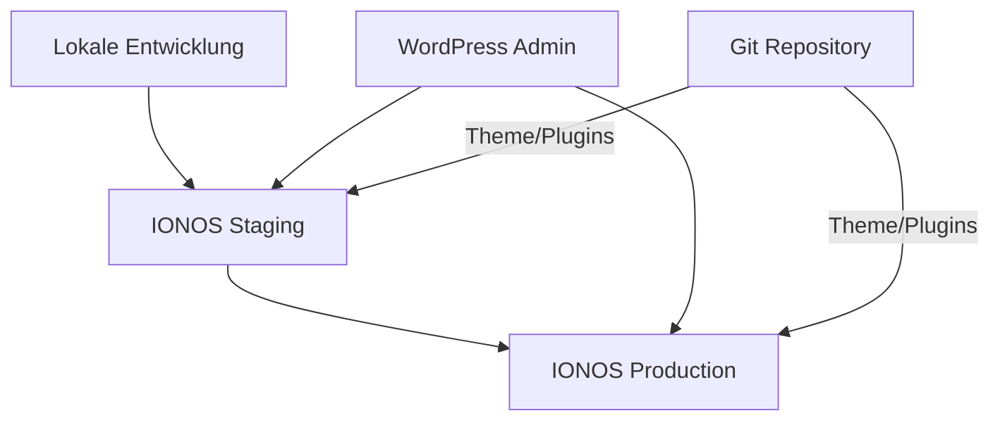

# WordPress Entwicklung & Deployment mit IONOS
*Eine umfassende Anleitung für professionelle WordPress-Entwicklung*

## 📑 Inhaltsverzeichnis
- [Entwicklungsumgebung](#entwicklungsumgebung)
- [Best Practices](#best-practices)
- [IONOS-Konfiguration](#ionos-konfiguration)
- [Sicherheits-Setup](#sicherheits-setup)
- [Workflow](#workflow)
- [Automatisierung](#automatisierung)
- [Tools](#tools)
- [Herausforderungen & Lösungen](#herausforderungen--lösungen)

## 🔄 Entwicklungsumgebung

### Architektur-Übersicht


### Komponenten
1. **Lokale Entwicklung**
   - IDE/Editor
   - Lokaler Server
   - Git
   - Build Tools

2. **Staging**
   - IONOS Staging-Umgebung
   - Test-Datenbank
   - Staging-Domain

3. **Production**
   - Live-Server
   - Production-Datenbank
   - Live-Domain

## ✨ Best Practices

### Lokale Entwicklung
- **Entwicklungstools**
  - Local by Flywheel oder XAMPP
  - VS Code mit WordPress-Erweiterungen
  - Git für Versionskontrolle
  - Node.js & npm für Build-Prozesse

- **Datenbank-Management**
  - WP Migrate DB Pro für Sync
  - Lokale Backup-Strategie
  - Separate Entwicklungsdatenbank

### Staging-Umgebung
- **Konfiguration**
  ```text
  - URL: staging.kunde.de
  - Identische WP-Version
  - Produktions-DB-Kopie
  - Zugriffsschutz
  ```

- **Zugriffskontrolle**
  ```apache
  # .htaccess Beispiel
  AuthType Basic
  AuthName "Staging"
  AuthUserFile /path/.htpasswd
  Require valid-user
  ```

## 🔧 IONOS-Konfiguration

### Hosting-Optionen

#### 1. WordPress Managed Hosting
```text
Vorteile:
✓ One-Click Staging
✓ Automatische Updates
✓ Integrierte Backups
✓ Optimierte Performance

Nachteile:
× Weniger Flexibilität
× Eingeschränkter Server-Zugriff
```

#### 2. Webhosting mit PHP
```text
Vorteile:
✓ Volle Kontrolle
✓ SSH-Zugang
✓ Git auf Server
✓ Custom Deployment

Nachteile:
× Mehr Verwaltungsaufwand
× Manuelle Updates
```

## 🔒 Sicherheits-Setup

### Basis-Sicherheit
```text
1. SSL/TLS-Verschlüsselung
2. Sichere Authentifizierung
3. Regelmäßige Backups
4. Update-Management
```

### Erweiterte Sicherheit
```text
- WordPress Security Plugin
- Datei-Berechtigungen
- .htaccess Schutz
- DB-Zugriffskontrollen
```

## 🔄 Workflow

### Entwicklungsprozess


### Deployment-Schritte
```bash
# 1. Lokale Entwicklung
git clone theme-repository
npm install
composer install

# 2. Staging Deployment
git push origin staging
ssh user@ionos-server
cd /staging/wp-content/themes/
git pull origin staging

# 3. Production Deployment
git checkout main
git merge staging
git push origin main
ssh user@ionos-server
cd /production/wp-content/themes/
git pull origin main
```

## 🤖 Automatisierung

### Deploy-Hooks
```php
// deploy.php Beispiel
<?php
$secret = "your-secret-key";
$repo = "/path/to/repository";

if ($_SERVER['HTTP_X_HUB_SIGNATURE'] == $secret) {
    shell_exec("cd {$repo} && git pull origin main");
}
```

### Backup-Automation
```bash
#!/bin/bash
# backup.sh
DATE=$(date +%Y-%m-%d)
wp db export backup-$DATE.sql
```

## 🛠 Tools

### Entwicklung
```text
Essential:
- Advanced Custom Fields PRO
- WP Migrate DB Pro
- Git
- Composer
- Node.js/npm

Optional:
- WordPress CLI
- PHP CodeSniffer
- ESLint
```

### Deployment
```text
- WP-CLI
- SSH/SFTP
- Rsync
- Deploy Scripts
```

### Monitoring
```text
- IONOS Control Panel
- WordPress Health Check
- Uptime Monitoring
- Performance Tracking
```

## 🎯 Herausforderungen & Lösungen

### 1. Datenbank-Synchronisation
```text
Problem:
- Unterschiedliche Umgebungen
- Große Datenbanken
- Sensible Daten

Lösung:
✓ WP Migrate DB Pro
✓ Automatisierte Sync-Scripts
✓ Daten-Maskierung
```

### 2. Plugin-Konflikte
```text
Problem:
- Inkompatible Plugins
- Performance-Einbrüche
- Sicherheitslücken

Lösung:
✓ Plugin-Audit
✓ Staging-Tests
✓ Dependency Management
```

### 3. Performance
```text
Problem:
- Langsame Ladezeiten
- Hohe Serverauslastung
- Große Medien-Dateien

Lösung:
✓ IONOS CDN
✓ Caching-Strategie
✓ Bildoptimierung
```

## 📚 Weiterführende Ressourcen

- [IONOS WordPress Dokumentation](https://www.ionos.de/hilfe/hosting/wordpress/)
- [WordPress Entwickler-Dokumentation](https://developer.wordpress.org/)
- [Git-Workflow Best Practices](https://www.atlassian.com/git/tutorials/comparing-workflows)

## 🔄 Updates & Wartung

### Regelmäßige Tasks
```text
Täglich:
- Backup-Check
- Uptime-Monitoring

Wöchentlich:
- Plugin-Updates
- Performance-Check

Monatlich:
- Sicherheits-Audit
- Backup-Test
```

### Notfall-Plan
```text
1. Backup-Wiederherstellung
2. Temporäre Wartungsseite
3. Problem-Diagnose
4. Lösung implementieren
5. Tests durchführen
6. Dokumentation aktualisieren
``` 